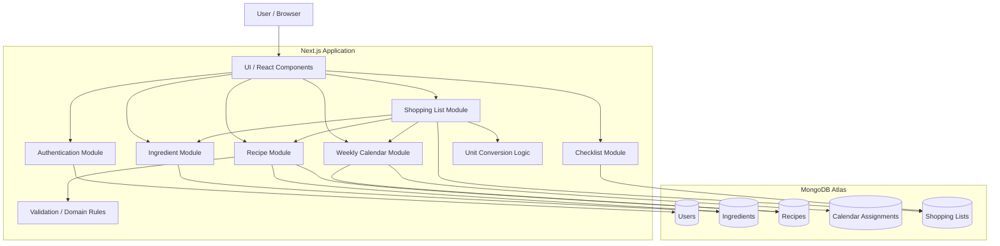
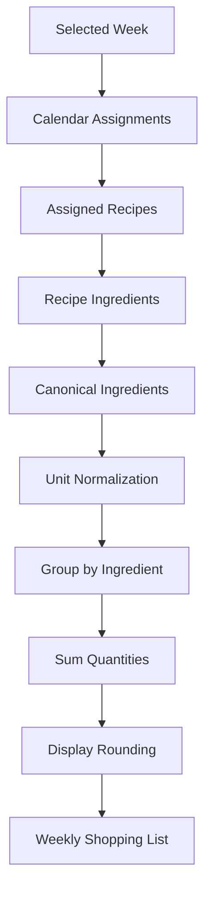
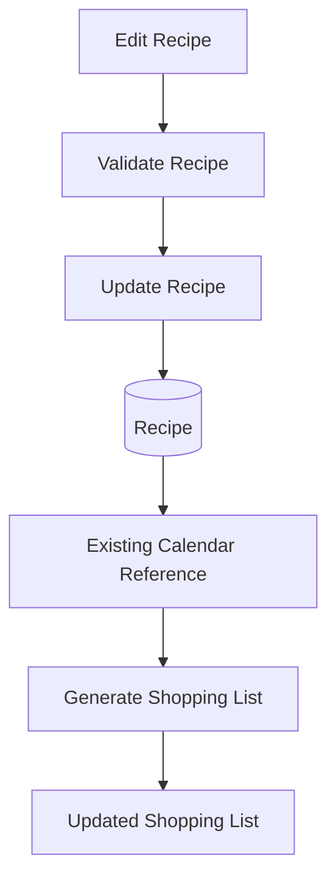
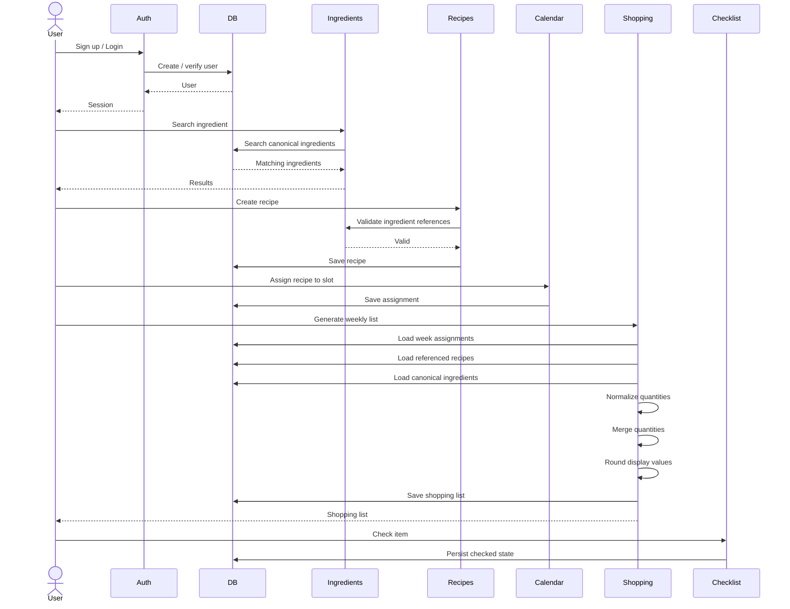

# Architecture — Meal Planner + Auto Shopping List

## 1. Purpose

This document describes the system architecture, component boundaries, data ownership, and key data flows for the **Meal Planner + Auto Shopping List** web application.

The primary audience is developers and coding agents working on the codebase.

An agent should read this document before making architectural changes. The goal is to make it clear:

- Which module owns which responsibility
- How data moves through the system
- Which components may depend on each other
- Which business rules must remain centralized
- Which changes are local versus cross-module
- Which features are MVP and which are explicitly deferred

The application is a single-tenant web application. Users authenticate with email/password and their recipes, meal plans, and shopping lists are isolated to their own account.

---

## 2. System Overview

The application allows a user to:

1. Create an account and log in.
2. Search for canonical ingredients.
3. Create custom ingredients when an ingredient does not exist.
4. Create recipes using canonical ingredients.
5. Assign recipes to days and meal slots in a weekly calendar.
6. Generate a shopping list from all recipes assigned to a selected week.
7. Merge identical canonical ingredients.
8. Normalize compatible units before merging.
9. Check off shopping-list items while shopping.

The central business flow is:

```text
User
  |
  v
Authentication
  |
  v
Recipes + Canonical Ingredients
  |
  v
Weekly Calendar
  |
  v
Shopping List Generation
  |
  v
Checklist
```

The important architectural characteristic is that the shopping list is **derived from the user's weekly meal assignments and recipe data**.

The recipe is not copied into the calendar as a snapshot. Calendar assignments reference recipes, allowing recipe changes to affect the generated shopping list.

The specification explicitly defines recipe edits as live references rather than snapshots.

---

# 3. Architectural Style

## Feature-based architecture

- Group each feature's components and feature-specific logic under `features/<feature-name>/` (e.g. `features/meal-plan/`, `features/shopping-list/`) — don't put feature UI directly in `app/` or in the shared `components/ui/` folder (that's reserved for shadcn/ui primitives).
- Suggested layout inside each feature folder:
  ```
  features/<feature-name>/
  ├── components/   # feature-specific UI components
  ├── hooks/        # feature-specific hooks (state, queries, mutations)
  └── index.ts      # barrel export — what app/ is allowed to import
  ```
- `app/page.tsx` (and other route files) are presentation-only: they import a feature's top-level component from `features/` and render it. See the "contain no state management logic" rule in Page and Layout file conventions below.
- Existing auth, app-shell, and dashboard UI follows this structure under
  `features/`; new feature UI must continue the same pattern.

Avoid introducing:

- Separate backend services
- Message queues
- Event buses
- Redis
- GraphQL
- Additional databases
- Complex distributed infrastructure

unless explicitly required by a future specification.

The defined technology stack is Next.js App Router with TypeScript/React, Tailwind CSS, MongoDB Atlas with Mongoose, NextAuth.js with credentials authentication, bcrypt, Vercel, MongoDB text search, and `convert-units`.

### Project structure

```
.
├── app/                  # App Router: pages, layouts, providers, co-located tests
│   ├── api/auth/         # NextAuth handler + registration route
│   ├── api/ingredients/  # Ingredient search/create (+ [id] update) routes
│   ├── api/recipes/      # Recipe CRUD (+ [id] get/update/delete) routes
│   ├── api/calendar/     # Calendar week read + assign (+ [id] remove) routes
│   ├── login/ register/  # Public auth pages
│   ├── dashboard/        # Server-protected dashboard page
│   ├── ingredients/      # Server-protected ingredient management page
│   ├── recipes/          # Server-protected Recipe Library, create, and edit pages
│   ├── calendar/         # Server-protected Weekly Plan (Calendar) page
│   └── layout.tsx, page.tsx, providers.tsx, globals.css
├── components/ui/     # shadcn/ui-generated primitives (do not hand-edit; see Stack notes)
├── features/          # Auth, app shell, dashboard, ingredients, recipes, and calendar feature UI
├── lib/               # Shared helpers, validation, MongoDB, and Mongoose models
├── auth.ts            # NextAuth credentials/session configuration
├── types/             # NextAuth session type augmentation
├── data/              # Seed data (data/ingredients-seed-data.js)
├── scripts/           # One-off/seed scripts (scripts/seed-ingredients.mjs)
├── test/              # Shared test helpers (test/test-utils.tsx)
├── public/            # Static assets
├── components.json    # shadcn/ui config
├── vitest.config.mts / vitest.setup.ts
└── .env.local         # local-only env overrides (gitignored)
```

This reflects the current high-level layout; update it when module boundaries
or data flow change.

# 4. High-Level Component Architecture



---

# 5. Component Responsibilities

## 5.1 Authentication Module

### Responsibility

Handles:

- User registration
- User login
- Password hashing
- Session persistence
- Authentication checks
- User identity available to server-side operations

### Technology

- NextAuth.js
- Credentials provider
- bcrypt

### Boundary

Authentication is responsible for answering:

> Who is the current user?

It is not responsible for:

- Recipe authorization logic
- Shopping-list generation
- Ingredient processing
- Calendar logic

### Data isolation rule

Every user-owned operation must resolve the authenticated user's identity before accessing user-owned data.

Conceptually:

```text
request
  |
  v
authenticate
  |
  v
currentUserId
  |
  v
query data WHERE owner/user = currentUserId
```

Never trust a client-provided user ID for authorization.

The specification requires that recipes, calendar entries, and shopping lists are scoped to the logged-in user and requests for another user's data are rejected.

---

# 6. Ingredient Module

## Responsibility

The Ingredient module manages the canonical ingredient vocabulary used by recipes.

It supports:

- Seeded global ingredients
- User-created custom ingredients
- Ingredient search
- Typeahead
- Exact-match duplicate protection
- Ingredient unit family
- Optional density information

The MVP starts with a 148-item seeded global ingredient list plus per-user custom ingredients.

## Ingredient categories

```text
Global seeded ingredient
        |
        +---- available to all users

User-created ingredient
        |
        +---- owned by a specific user
```

## Required ingredient properties

At minimum:

```text
name
unitFamily
owner/scope
```

Optional information may include:

```text
density
calorie information
```

Density and calorie information are not required for ingredient creation in the MVP.

## Search boundary

Ingredient search should be handled by the Ingredient module.

Recipe code should not directly implement ingredient search.

```text
Recipe UI
   |
   v
Ingredient Search
   |
   v
Ingredient Module
   |
   v
MongoDB text index
```

MongoDB text search is the defined search mechanism for the seeded ingredient collection.

---

# 7. Recipe Module

## Responsibility

The Recipe module owns:

- Recipe creation
- Recipe retrieval
- Recipe editing
- Recipe deletion
- Recipe ingredient rows
- Recipe servings
- Recipe validation

A recipe contains references to canonical ingredients rather than arbitrary free-text ingredient names.

Conceptually:

```text
Recipe
│
├── name
├── servings
├── imageUrl (optional)
└── ingredients
    ├── ingredientId
    ├── quantity
    └── unit
```

`imageUrl`, when set, is a Vercel Blob URL, never a local filesystem path
or an inline image — this app has no persistent server-local disk in
production (Vercel serverless), so the actual file bytes live in Vercel
Blob storage and the Recipe document only holds a pointer to it. See
DECISIONS.md "Recipe image upload (Vercel Blob)" for the full upload flow
and `lib/recipeImageStorage.ts` for cleanup on replace/delete.

## Recipe creation rules

A recipe:

- Must have a name
- Must have a servings count
- Must contain at least one ingredient
- Every ingredient must have a quantity
- Every ingredient must have a unit
- Ingredients should reference canonical ingredient records

The specification explicitly prevents recipes from being saved with zero ingredients or missing quantity/unit.

---

# 8. Recipe → Ingredient Boundary

The Recipe module owns recipe composition.

The Ingredient module owns ingredient identity.

Therefore:

```text
Recipe
  |
  | references
  v
Canonical Ingredient
```

Do not duplicate canonical ingredient definitions inside recipes.

For example, avoid:

```text
{
  ingredientName: "Sugar"
}
```

when the system already has a canonical ingredient.

Prefer:

```text
{
  ingredientId: "...",
  quantity: 2,
  unit: "tbsp"
}
```

This canonical reference is what allows the shopping-list module to recognize that two recipes use the same ingredient.

The specification identifies free-text ingredient duplication as a core problem and requires recipes to use the canonical ingredient list.

---

# 9. Weekly Calendar Module

## Responsibility

The Calendar module owns:

- Weekly navigation
- Day selection
- Meal slot selection
- Recipe assignment
- Replacement of recipes in occupied slots

Supported meal slots:

```text
Breakfast
Lunch
Dinner
```

Each calendar slot can contain exactly one recipe.

Assigning a new recipe to an occupied slot replaces the previous assignment.

## Calendar data relationship

```text
User
 |
 +-- Week
      |
      +-- Day
           |
           +-- Meal Slot
                |
                +-- Recipe Reference
```

The calendar should reference the recipe rather than duplicate the entire recipe.

---

# 10. Calendar → Recipe Boundary

The Calendar module may read recipe information to display assigned meals.

However, the Calendar module should not own recipe data.

```text
Calendar
   |
   | recipeId
   v
Recipe
```

This is important because recipe changes must propagate to shopping-list generation.

Example:

```text
Monday Dinner
    |
    +--> Recipe A
```

Later:

```text
Recipe A
    |
    +--> Ingredient quantity changed
```

The calendar assignment remains valid because it references Recipe A.

The next shopping-list generation uses the updated recipe.

---

# 11. Shopping List Module

## Responsibility

The Shopping List module is the main derived-data/business-logic module.

It:

1. Reads a selected week.
2. Finds all recipes assigned during that week.
3. Reads ingredient rows from those recipes.
4. Resolves canonical ingredients.
5. Normalizes compatible units.
6. Groups items by canonical ingredient.
7. Sums quantities.
8. Applies display rounding.
9. Produces the week's shopping list.
10. Persists the list/check state where required.

The specification defines the shopping list as being generated from every recipe assigned anywhere in the selected week.

---

# 12. Core Shopping List Data Flow



---

# 13. Unit Conversion Boundary

Unit conversion belongs to the shopping-list/domain logic rather than the UI.

The conversion module should provide a consistent interface such as:

```text
normalize(quantity, unit, ingredient)
```

The MVP supports same-family conversion.

### Volume

```text
tsp
tbsp
cup
fl oz
```

are normalized to:

```text
ml
```

### Weight

```text
oz
lb
```

are normalized to:

```text
g
```

### Count

Count ingredients remain counts.

For example:

```text
2 eggs
+
3 eggs
=
5 eggs
```

Count units must not be converted into weight or volume.

The specification defines these same-family conversions and explicitly states that density-based cross-family conversion is deferred for the delivery.

---

# 14. Cross-Family Conversion

Cross-family conversion is conditional.

Example:

```text
tablespoons of sugar
        |
        v
density available?
   /          \
 yes           no
 |              |
 v              v
grams        keep original
             unit/line
```

If density is available:

```text
volume
  +
density
  =
weight
```

If density is unavailable, the system must not block recipe creation.

Instead, the mismatched quantity remains a separate shopping-list line.

This behavior is explicitly defined in the ingredient requirements.

---

# 15. Shopping List Merge Rules

The fundamental merge key is the **canonical ingredient identity**.

Example:

```text
Recipe A
2 tbsp Sugar

Recipe B
1 tbsp Sugar
```

After normalization:

```text
Recipe A -> 30ml
Recipe B -> 15ml
```

Then:

```text
Sugar -> 45ml
```

The system should not merge merely because two ingredient names look similar.

MVP duplicate handling is based on canonical identity/exact matching; fuzzy near-duplicate matching is explicitly deferred.

---

# 16. Shopping List Rounding

After quantities have been merged:

```text
normalized quantity
        |
        v
round to clean display quantity
        |
        v
shopping list item
```

The specified display behavior is:

- Nearest 5g for weight
- Nearest 5ml for volume
- Use kg/L above 1000g/ml

Do not apply display rounding before merging.

Correct:

```text
normalize
→ merge
→ sum
→ round
```

Incorrect:

```text
normalize
→ round each recipe
→ merge
```

The latter can produce incorrect totals.

---

# 17. Checklist Module

The Checklist module owns the user's checked/unchecked shopping state.

Each shopping item can be:

```text
unchecked
checked
```

The checked state must survive:

- Page refresh
- Logout
- Login

and must remain associated with the specific week's shopping list.

Checklist state should not be treated as a global ingredient property.

Incorrect:

```text
Sugar = checked
```

Correct concept:

```text
Week 2026-08-17
    |
    +-- Sugar
          |
          +-- checked = true
```

---

# 18. Data Ownership

| Data                | Owner                   | Used By            |
| ------------------- | ----------------------- | ------------------ |
| User                | Authentication          | All user modules   |
| Global Ingredient   | Ingredient module       | Recipe, Shopping   |
| Custom Ingredient   | Ingredient module       | Recipe, Shopping   |
| Recipe              | Recipe module           | Calendar, Shopping |
| Calendar Assignment | Calendar module         | Shopping           |
| Shopping List       | Shopping module         | Checklist/UI       |
| Checked State       | Checklist/Shopping List | Checklist/UI       |

The general dependency direction is:

```text
Authentication
      |
      v
Ingredients
      |
      v
Recipes
      |
      v
Calendar
      |
      v
Shopping List
      |
      v
Checklist
```

This follows the specification's stated module data flow: each MVP module depends on data created by the module before it.

---

# 19. Database Boundary

MongoDB Atlas is the persistence layer.

Mongoose is responsible for:

- Schema definitions
- Validation
- Database interaction
- Model-level constraints

The application should not expose raw database access throughout UI components.

Prefer:

```text
UI
 |
 v
Server/Application Logic
 |
 v
Mongoose Model
 |
 v
MongoDB
```

Avoid:

```text
React Component
 |
 +--> MongoDB query
```

Database access should remain on the server side.

---

# 20. User Data Isolation

All user-owned data must have an ownership boundary.

Conceptually:

```text
User A
 |
 +-- Recipes
 +-- Calendar
 +-- Shopping Lists

User B
 |
 +-- Recipes
 +-- Calendar
 +-- Shopping Lists
```

Never allow:

```text
User A request
      |
      v
Recipe belonging to User B
```

to succeed.

Authorization must be enforced at the server/application boundary, not only by hiding records in the UI.

---

# 21. Recipe Edit Data Flow

Recipe edits must affect future shopping-list results immediately.



There should not be a copied recipe snapshot inside the calendar assignment.

---

# 22. Recipe Delete Data Flow

Deleting a recipe requires special handling when it is assigned to the calendar.

```text
Delete Recipe
      |
      v
Find Calendar Assignments
      |
      +---- none ----> Delete Recipe
      |
      +---- found
             |
             v
       Show Warning
             |
             v
          Confirm
             |
             v
       Delete Recipe
             |
             v
   Remove Assignments
             |
             v
   Update Affected Lists
```

The user must be warned when a recipe is assigned to one or more calendar days.

The warning should communicate how many days are affected.

The specification explicitly requires the assignments to be removed and affected shopping lists updated after confirmation.

---

# 23. Weekly Shopping List Independence

Each week is an independent planning context.

```text
Week A
  |
  +-- Assignments
  +-- Shopping List

Week B
  |
  +-- Assignments
  +-- Shopping List
```

Generating or modifying the shopping list for Week A must not accidentally modify Week B.

The specification explicitly states that each week's assignments and shopping list are independent.

---

# 24. Empty and Partial Week Behavior

## Empty week

```text
No assigned meals
       |
       v
Empty-state shopping list
```

Do not generate arbitrary ingredient data.

## Partial week

Example:

```text
21 available meal slots

3 assigned
18 empty
```

The shopping list contains ingredients from the three assigned meals only.

There is no minimum number of assigned meals required.

---

# 25. End-to-End Primary Flow

The most important application flow is:



---

# 26. API / Server Boundary

The exact API route structure is an implementation detail unless separately specified.

Regardless of route naming, server operations should follow:

```text
Request
  |
  v
Authentication
  |
  v
Input Validation
  |
  v
Authorization / Ownership Check
  |
  v
Application Logic
  |
  v
Database
```

For derived operations:

```text
Request
  |
  v
Authentication
  |
  v
Validate Week
  |
  v
Load Calendar
  |
  v
Load Recipes
  |
  v
Generate Shopping List
  |
  v
Persist Result
  |
  v
Response
```

Do not place important business rules exclusively in React components.

---

# 27. Validation Boundaries

Validation should occur at multiple levels.

## UI validation

Provides immediate user feedback.

Example:

```text
Quantity required
Unit required
Recipe name required
```

## Server validation

Must enforce the same business rules independently.

The server must not trust the UI.

## Database validation

Mongoose schemas should provide structural validation.

The rule is:

```text
UI validation = user experience

Server validation = business correctness

Database validation = persistence safety
```

---

# 28. Important Domain Invariants

Agents must preserve these rules.

### Authentication

- User data is isolated by authenticated user.
- A user cannot access another user's data.

### Ingredients

- Recipes use canonical ingredient references.
- Ingredient creation requires a name and unit family.
- Duplicate protection must be applied.
- Newly created ingredients are immediately searchable.
- Only the ingredient's owner may edit it; global/seeded ingredients
  (`userId: null`) and other users' ingredients are read-only through the
  Ingredient module's API.
- Editing a custom ingredient affects every recipe that references it
  immediately (live reference, same principle as §21's recipe-edit
  propagation) — the user must be warned before confirming an edit. See
  DECISIONS.md for why this warning is generic text rather than an
  affected-recipe count in this delivery.
- Ingredient delete is not implemented — see KNOWN_ISSUES.md.

### Recipes

- Recipe cannot have zero ingredients.
- Ingredient quantity is required.
- Ingredient unit is required.
- Recipe edits affect references immediately.
- Deleting an assigned recipe requires confirmation.

### Calendar

- One recipe per slot.
- Reassigning a slot replaces the existing recipe.
- Weeks are independent.

### Shopping List

- Include all recipes assigned in the selected week.
- Include only assigned meals.
- Normalize before merging.
- Merge by canonical ingredient.
- Count ingredients remain counts.
- Cross-family conversion depends on density.
- Missing density must not block recipe creation.

### Checklist

- Checked state persists across sessions.
- Checklist state belongs to the specific week's shopping list.

---

# 29. MVP Boundary

The following are inside the MVP:

```text
Authentication
    |
    +-- Signup
    +-- Login
    +-- Persisted session

Ingredients
    |
    +-- Seeded ingredients
    +-- Custom ingredients
    +-- Search
    +-- Duplicate protection

Recipes
    |
    +-- Create
    +-- Edit
    +-- Delete

Calendar
    |
    +-- Weekly navigation
    +-- Breakfast
    +-- Lunch
    +-- Dinner
    +-- Recipe assignment

Shopping List
    |
    +-- Generate
    +-- Same-family normalization
    +-- Merge
    +-- Rounding/display

Checklist
    |
    +-- Check/uncheck
    +-- Persistence
```

---

# 30. Explicitly Deferred Features

Agents must not implement these unless the task explicitly requests them:

- Fuzzy ingredient matching
- Advanced cross-family density conversion beyond the defined behavior
- Advanced quantity formatting
- Repeat recipe across multiple days
- Recipe duplication
- Drag-and-drop calendar
- Password reset
- Household/shared accounts
- Nutrition tracking
- Serving scaling
- Ingredient aisle categorization
- Recipe import from URL
- Recipe snapshot/versioning
- Batch-cook quantity scaling
- Offline mode

These are identified as future features or limitations in the specification.
---

# 31. Future-Proofing Rules

Future features should extend the existing boundaries rather than bypass them.

For example:

```text
Future fuzzy ingredient matching
        |
        v
Ingredient Module
```

not:

```text
Recipe Module
    |
    +-- custom fuzzy matching
```

Similarly:

```text
Future nutrition tracking
        |
        v
Nutrition Module
```

rather than embedding nutrition logic throughout recipes and shopping lists.

The current architecture should remain simple enough for the two-week MVP while keeping domain responsibilities isolated.

---

# 32. Agent Change Guidelines

Before changing code, an agent should identify:

1. Which module owns the behavior?
2. Which data does the behavior read?
3. Which data does it modify?
4. Does the change affect another module?
5. Does the change alter an existing domain invariant?
6. Is the requested feature MVP or explicitly deferred?
7. Does the change affect user-data isolation?
8. Does the change affect shopping-list calculations?

### Example

If asked:

> "Change how ingredients merge on the shopping list."

The agent should primarily inspect:

```text
Shopping List
    |
    +-- normalization
    +-- grouping
    +-- merge logic
    +-- conversion
```

It should not modify recipe storage unless required.

---

# 33. Dependency Rules

Preferred dependency direction:

```text
UI
 |
 v
Application Modules
 |
 v
Domain Logic
 |
 v
Persistence
```

Cross-module dependencies should be intentional.

Preferred:

```text
Shopping List
    |
    +--> Calendar
    +--> Recipes
    +--> Ingredients
    +--> Conversion
```

Avoid circular dependencies such as:

```text
Recipe -> Shopping
Shopping -> Recipe
Recipe -> Calendar
Calendar -> Recipe
Shopping -> Calendar
Calendar -> Shopping
```

If a circular dependency appears necessary, move the shared business logic into a domain/service layer.

---

# 34. Where Business Logic Should Live

| Logic                           | Recommended Owner       |
| ------------------------------- | ----------------------- |
| Password hashing                | Authentication          |
| Session validation              | Authentication          |
| Ingredient search               | Ingredient module       |
| Ingredient duplicate validation | Ingredient module       |
| Recipe validation               | Recipe module           |
| Calendar slot replacement       | Calendar module         |
| Week navigation                 | Calendar module         |
| Unit normalization              | Conversion/domain logic |
| Ingredient merging              | Shopping List           |
| Shopping quantity rounding      | Shopping List           |
| Shopping list generation        | Shopping List           |
| Checked state                   | Checklist/Shopping List |

Business rules should not be duplicated across UI components.

---

# 35. Error Boundaries

Errors should be handled at the layer where they can be meaningfully interpreted.

```text
Database error
    |
    v
Persistence layer
    |
    v
Application error
    |
    v
API/server response
    |
    v
UI error state
```

Examples:

### Invalid recipe

```text
Recipe validation
    |
    v
400 / validation response
```

### Unauthorized access

```text
Authentication/authorization
    |
    v
Unauthorized response
```

### Missing recipe during calendar operation

```text
Calendar validation
    |
    v
Application error
```

### Missing density

This is not a fatal error.

It is a supported business condition:

```text
density missing
    |
    v
skip cross-family conversion
    |
    v
keep separate shopping-list line
```

---

# 36. Performance Boundaries

The MVP is designed for a relatively small dataset and a short delivery window.

Do not prematurely introduce complex optimization.

The main performance-sensitive operation is shopping-list generation:

```text
Week
 ↓
Assignments
 ↓
Recipes
 ↓
Ingredient rows
 ↓
Normalization
 ↓
Grouping
 ↓
Aggregation
```

This should remain a deterministic server-side operation.

MongoDB text indexing is used for ingredient search.

---

# 37. Testing Priorities

The most important tests are domain-level tests.

## Authentication

```text
signup
login
session persistence
unauthorized access
cross-user access rejection
```

## Ingredients

```text
search
create
duplicate protection
custom ingredient visibility
```

## Recipes

```text
valid recipe
missing ingredient
missing quantity
missing unit
edit
delete
```

## Calendar

```text
assign recipe
replace recipe
navigate weeks
independent weeks
```

## Shopping List

```text
empty week
partial week
multiple recipes
same ingredient merge
same-family conversion
count ingredients
missing density
rounding
```

## Checklist

```text
check
uncheck
refresh persistence
logout/login persistence
week-specific state
```

The specification defines end-to-end success as:

```text
signup
→ recipe
→ calendar assignment
→ shopping list
→ checklist
```

with shopping-list output matching the verified same-family conversion algorithm cases.

---

# 38. Primary Agent Mental Model

An agent should understand the application using this simplified model:

```text
USER
 |
 +----------------------+
 |                      |
 v                      v
AUTH              INGREDIENTS
                       |
                       v
                    RECIPES
                       |
                       v
                   CALENDAR
                       |
                       v
                SHOPPING LIST
                       |
                       v
                   CHECKLIST
```

The key relationship is:

```text
Recipes are reusable definitions.

Calendar contains references to recipes.

Shopping List is derived from recipes referenced by the selected week.

Checklist stores the user's shopping progress for that week's list.
```

---

# 39. Critical Rule: Do Not Break the Derived Data Flow

The most important architectural constraint is:

```text
Calendar
   |
   v
Recipe references
   |
   v
Recipe ingredients
   |
   v
Canonical ingredients
   |
   v
Normalization
   |
   v
Aggregation
   |
   v
Shopping list
```

An implementation should not create independent ingredient definitions inside calendar entries or shopping-list generation.

This preserves the application's central promise:

> Assigning recipes to the weekly calendar is enough to generate the shopping list automatically.

The specification explicitly identifies this connected recipe → calendar → shopping-list workflow as the core product behavior.

---

# 40. Architecture Decision Summary

| Decision                         | MVP Choice                              |
| -------------------------------- | --------------------------------------- |
| Architecture                     | Modular monolith                        |
| Frontend                         | Next.js App Router + React + TypeScript |
| Styling                          | Tailwind CSS                            |
| Backend                          | Next.js server-side application logic   |
| Database                         | MongoDB Atlas                           |
| ODM                              | Mongoose                                |
| Authentication                   | NextAuth.js credentials                 |
| Password hashing                 | bcrypt                                  |
| Ingredient search                | MongoDB text index                      |
| Unit conversion                  | `convert-units`                         |
| Hosting                          | Vercel                                  |
| Data isolation                   | Per authenticated user                  |
| Recipe/calendar relationship     | Live recipe reference                   |
| Shopping list                    | Derived from weekly assignments         |
| Fuzzy matching                   | Deferred                                |
| Advanced cross-family conversion | Deferred                                |
| Offline mode                     | Not supported                           |

These technology choices are based directly on the project specification.

---

# 41. Final Architecture Principle

The application should remain **simple, modular, and domain-driven around the core meal-planning flow**.

The primary architectural contract is:

```text
Authenticate User
       ↓
Manage Canonical Ingredients
       ↓
Build Reusable Recipes
       ↓
Assign Recipes to Weekly Slots
       ↓
Generate Shopping List
       ↓
Check Items
```

When modifying the application, preserve:

1. User data isolation.
2. Canonical ingredient references.
3. Live recipe references from calendar assignments.
4. Deterministic shopping-list generation.
5. Correct unit normalization before aggregation.
6. Week-level independence.
7. Persistent checklist state.
8. Clear separation between MVP and deferred features.

Any architectural change that violates one of these principles should be treated as a significant change and reviewed before implementation.
